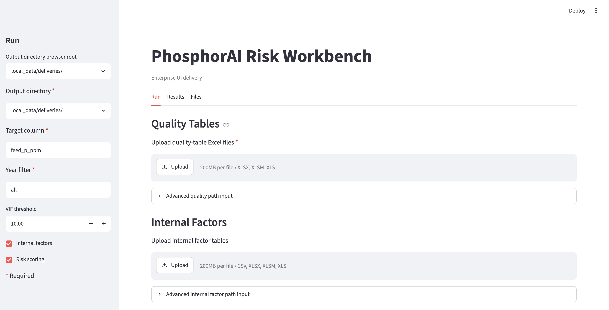
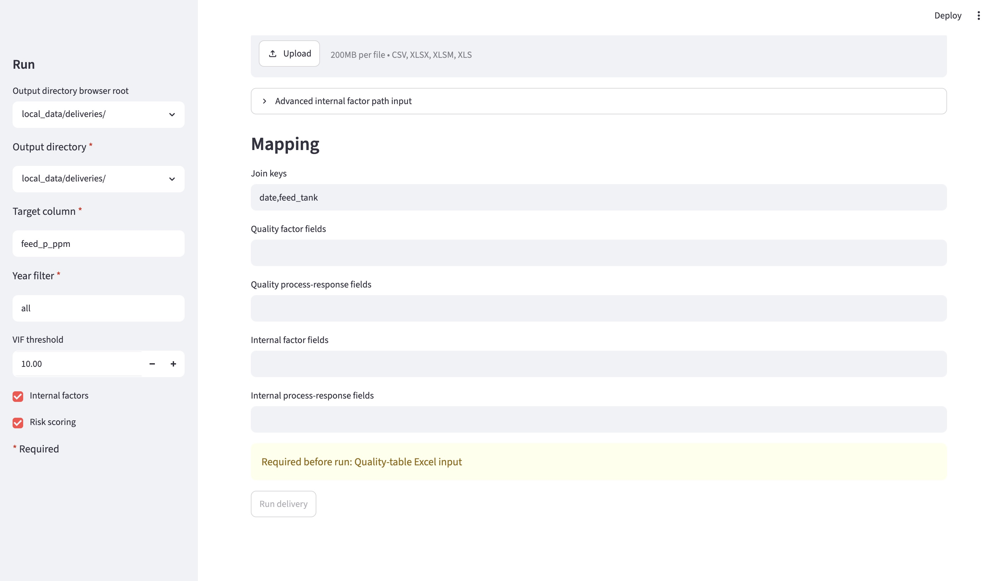

# PhosphorAI Risk Workbench

PhosphorAI is a local Streamlit workbench for enterprise CPO phosphorus
feasibility review. It validates quality-table inputs, joins internal factor
tables when provided, screens factor evidence, produces a high-phosphorus manual
review ranking, and writes a CSV / JSON / HTML report package to a user-selected
folder.

The workbench does **not** replace laboratory phosphorus testing, does **not**
automate batch segregation, and does **not** optimize phosphoric acid or
bleaching earth dosing automatically.

## Install

Use Python 3.11 or newer.

```bash
python3 -m pip install -U pip
python3 -m pip install -e .
```

Optional local defaults can be configured from `.env.example`.

```bash
make init-config
```

## Launch

```bash
make ui
```

The Streamlit UI is the supported enterprise entry point. Select quality-table
Excel inputs, optional internal factor tables, mapping fields, and an output
directory in the browser.

The run page includes an output-directory browser, so local simulations can
select where the report package should be written without typing the full path.
Input files can be supplied through upload widgets; advanced server-side path
text areas remain available for local paths when needed.

## UI Usage Guide

Use the `Run` tab to configure and start a local enterprise delivery run. Fields
marked with a red `*` are required. The `Run delivery` button stays disabled
until all required fields are present.



The left sidebar controls run-level settings:

- `Output directory browser root`: choose the local folder tree to browse.
- `Output directory *`: choose where the delivery package should be written.
  Each run creates a new `phosphorai_run_<timestamp>/` subfolder inside it.
- `Target column *`: defaults to `feed_p_ppm`.
- `Year filter *`: defaults to `all`; use a single year or comma-separated
  years only when the input data supports that filter.
- `VIF threshold`: preprocessing threshold for severe multicollinearity checks.
- `Internal factors`: enable optional internal factor validation.
- `Risk scoring`: enable the Limited Human Review risk-ranking workflow.

The main `Run` tab contains the input sections:

- `Quality Tables`: upload one or more quality-table Excel files. This is
  required unless an advanced server-side quality path is provided.
- `Advanced quality path input`: optional local server-side path input for
  simulations where files are already on disk.
- `Internal Factors`: optionally upload internal factor CSV or Excel files.
- `Advanced internal factor path input`: optional local server-side path input
  for internal factor tables already on disk.



The `Mapping` section controls how quality-table rows and optional internal
factor rows are interpreted:

- `Join keys`: defaults to `date,feed_tank`. If internal factor validation is
  enabled and internal factor inputs are provided, this field is required.
- `Quality factor fields`: optional comma-separated quality-table fields for
  explicit factor screening.
- `Quality process-response fields`: optional quality-side process response
  fields, such as downstream response indicators.
- `Internal factor fields`: optional comma-separated internal fields to validate.
- `Internal process-response fields`: optional internal process fields for
  observed response evidence.

If required inputs are missing, the UI shows `Required before run: ...` and the
`Run delivery` button remains disabled. After the run finishes, open `Results`
for quality validation, join diagnostics, risk scoring, Limited Human Review
guidance, and the PGEO data-roadmap discussion. Open `Files` to inspect the
generated package paths, including `enterprise_summary.html`,
`run_manifest.json`, and `run_log.txt`.

Each run creates a folder such as:

```text
<selected-output-dir>/phosphorai_run_<timestamp>/
```

The report package includes:

- `run_manifest.json`
- `run_log.txt`
- `quality_validation_summary.json`
- `preprocessing_summary.json`
- `core_factor_screening.csv`
- `core_factor_screening.json`
- `internal_factor_evidence.csv`
- `internal_factor_evidence.json`
- `risk_scoring_batch_ranking.csv`
- `enterprise_summary.html`

Some files are generated only when the corresponding internal-factor or risk
scoring step is enabled and has enough data.

## Project Structure

The tracked project is intentionally compact:

```text
PhosphorAI/
├── README.md
├── Makefile
├── pyproject.toml
├── scripts/
│   └── run_ui.py
├── src/cpo_phosphorus/
│   ├── pipelines/      # quality-table preprocessing
│   ├── models/         # retained feed-risk model
│   ├── workflows/      # enterprise delivery orchestration
│   └── ui/             # Streamlit app and README UI assets
└── tests/
    └── test_workflow_skeleton.py
```

Local data, generated deliveries, old reports, archived capstone materials, and
environment-specific files stay in ignored local directories such as
`local_data/`, `local_archive/`, `.venv/`, and `.cache/`.

## Limited Human Review

Risk scoring outputs are review-priority aids only. When predicted feed
phosphorus is at or above the prototype high-risk cutoff, the row enters a
manual review queue sorted by predicted phosphorus risk. Quality or operations
teams can use the top candidates for prioritized lab follow-up, retesting
discussion, and operator attention.

The queue does not authorize automatic batch isolation, acid dosing,
bleaching-earth dosing, or replacement of laboratory phosphorus testing.

The enterprise summary also includes a PGEO data-roadmap section covering
supplier/mill, storage duration, tank residence time, lab timestamp alignment,
phospholipid/gum/NHP, trace metals, weather/harvest context, and process
settings for future field-availability discussion.

## Input Expectations

Quality-table Excel files must follow the current template: data rows start at
row 5 and business fields are read from columns B:U. Multiple files and years
are supported.

Internal factor tables may be CSV or Excel. A single file, a directory, or
multiple files can be supplied. Use reliable join keys such as `sample_id`,
`batch_id`, `lot_id`, or a practical composite key such as `date,feed_tank`.
Low match rates or duplicate join keys block strong factor conclusions.

## Evidence Levels

- `direct_supported`: supplied enterprise fields show stable association or
  model signal.
- `weak_or_context_dependent`: signal exists but is not stable or strong enough.
- `not_supported_current_data`: fields exist but current data does not show a
  useful signal.
- `not_assessable`: required fields or joins are missing.
- `observed_process_response`: process fields show observed downstream response
  evidence, not automatic dosing authorization.

## Local Data

Confidential raw data and generated outputs should stay local. Recommended
ignored locations:

```text
local_data/raw/          # confidential Excel inputs
local_data/internal/     # confidential internal factor tables
local_data/deliveries/   # generated enterprise report packages
local_archive/           # old local academic materials and historical runs
```

## Verify

```bash
make verify
```
